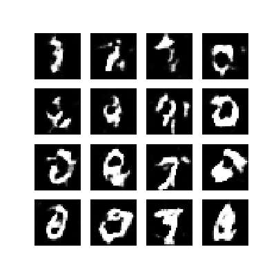

# 手写数字生成

通过使用深度卷积生成对抗网络，学习生成手写数字，参考[Tensorflow示例](https://www.tensorflow.org/tutorials/generative/dcgan)。  
所使用的MNIST数据集默认下载在`~/.keras/datasets`，因而训练不需要手动下载任何的数据集，直接运行即可。  

## 模型

### 随机生成

参照示例中的模型，实现以随机数为输入生成手写数字。  
训练30个Epoch之后效果如下：  



### 生成指定数字

新增的功能，可以控制数字的生成。同样的在训练了30个Epoch之后生成效果如下：  

 

#### 衍生问题

在模型构建的过程中，使用了`one-hot`形式表示的标签作为`generator`和`discriminator`的输入。  
而在起初搭建模型的时候，直接使用了单一数字标识标签，生成的效果很不好。  

- [ ] 为何在这里使用`one-hot`形式标识的标签，生成效果好？

## 文件结构

```shell
.
├── configs
│   ├── default.py
│   ├── __init__.py
│   └── specified_digit.py
├── data_loaders
│   ├── __init__.py
│   └── load_mnist.py
├── _images
│   ├── generate_history.gif
│   └── generate_specified_digit.png
├── logs
│   ├── generate_from_random_noise
│   │   ├── checkpoint
│   │   │   ├── checkpoint
│   │   │   └── ...
│   │   ├── generate_history.gif
│   │   └── generate_output
│   │       ├── image_at_epoch_01.png
│   │       └── ...
│   └── generate_specified_number
│       ├── checkpoint
│       │   ├── checkpoint
│       │   └── ...
│       ├── generate_history.gif
│       └── generate_output
│           ├── image_at_epoch_00.png
│           └── ...
├── models
│   ├── __init__.py
│   ├── random_noise
│   │   ├── dcgan_discriminator.py
│   │   ├── dcgan_generator.py
│   │   └── __init__.py
│   └── specified_digits
│       ├── dcgan_discriminator.py
│       ├── dcgan_generator.py
│       └── __init__.py
├── README.md
├── templates
│   ├── data_loader_template.py
│   ├── __init__.py
│   ├── model_templet.py
│   └── trainer_template.py
├── trainers
│   ├── __init__.py
│   ├── random_noise.py
│   └── specified_digit.py
├── train_random_noise.py
└── train_specified_digit.py
```