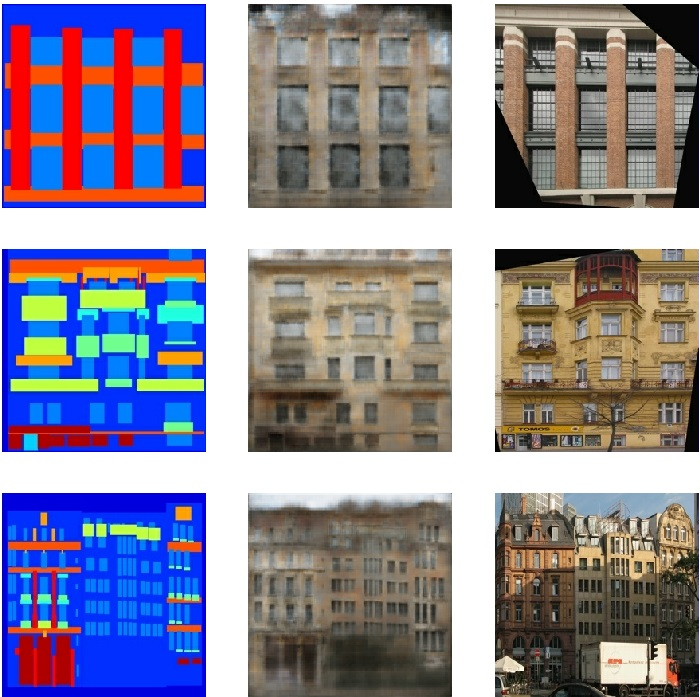

# Pix2Pix common framwork

这一部分代码试图实现Pix2Pix框架，以供之后需要的时候使用。Pix2Pix的本来目的就是建立一个“图像翻译”的通用框架，他们提出的“图像翻译”的概念着实有意思。  

> Traditionally, each of these tasks has been tackled with separate, special-purpose machinery, despite the fact that the setting is always the same: predict pixels from pixels. Our goal in this paper is to develop a common framework for all these problems. [^1]

目前的模型参照Tensoflow的示例程序来编写[^2]，由于发现参数调整后生成效果不佳，且模型训练速度较慢（个人电脑上100 Epoch需要运行2h）所以全部参照其参数来定义模型，待有时间再进一步探究其参数的意义。  

## 已有训练模型

### CMP Facade Database

继隔壁的“教模型写数字”[^3]结束后，又来教模型“造房子”了。 ;-)

简单的训练了100 Epoch之后（直接运行`train.py`）效果如下图所示：
对照着Tensorflow的训练效果，还是有一定的提升空间的。参照论文[^1]中描述，可以考虑减小`L1`损失来提高细节纹理，之后会再做一些跟进。

<!-- footnotes -->

[^1]: 论文：[Image-to-Image Translation with Conditional Adversarial Networks](https://arxiv.org/abs/1611.07004)
[^2]: [Pix2Pix  |  TensorFlow Core](https://www.tensorflow.org/tutorials/generative/pix2pix)
[^3]: [Machine-Learning/Generation/Handwritten digit generation with DCGAN at master · AcherStyx/Machine-Learning](https://github.com/AcherStyx/Machine-Learning/tree/master/Generation/Handwritten%20digit%20generation%20with%20DCGAN)
