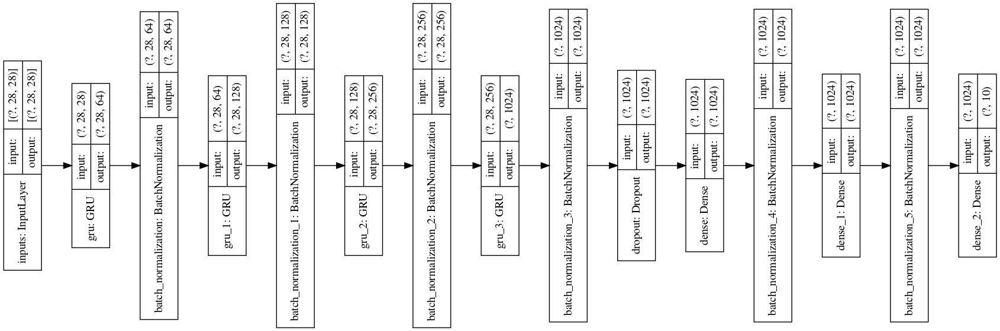
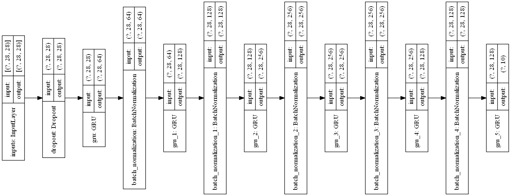

# MNIST digits classification with RNN

使用RNN实现的MNIST手写数字识别。在测试中，RNN在识别上也具有良好的性能。  

由于RNN只接受一个序列化的输入，使用RNN来进行图像的分类，首先需要进行图像的序列化，分为两种方法：  

1. **Row By Row**：按列（行）进行序列化。  
2. **Pixel by pixel**：按像素进行序列化。  

## 网络结构

所有的深度学习模型均采用了RNN，其中以按列序列化的方式作为输入。  

目前一共测试了两种网络类型：  

**1. 在RNN之后跟随一系列的全连接层完成分类。**



```py
# 参数量
Total params: 6,450,826
Trainable params: 6,443,786
Non-trainable params: 7,040
```

**2. 完全使用RNN获得分类结果。**



```py
Total params: 939,496
Trainable params: 937,832
Non-trainable params: 1,664
```

## 训练

在约2~3 Epoch的训练之后，验证集上正确率均可达到90%以上。在少数Epoch后正确率就基本不再有显著的上升（毕竟只是简单分类问题，难以看出差距），稳定在97%~98%。  
在起初模型构建的时候没有应用批量正则化，模型训练时正确率一直在基准水平，所以最好还是使用批量正则化。  

## 关于运行环境

由于在Windows环境下，目前的Tensorflow版本（`v2.1/v2.0`）存在诸多的问题（`callbacks`部分存在兼容性问题），因而模型需要在Linux下进行训练。  
